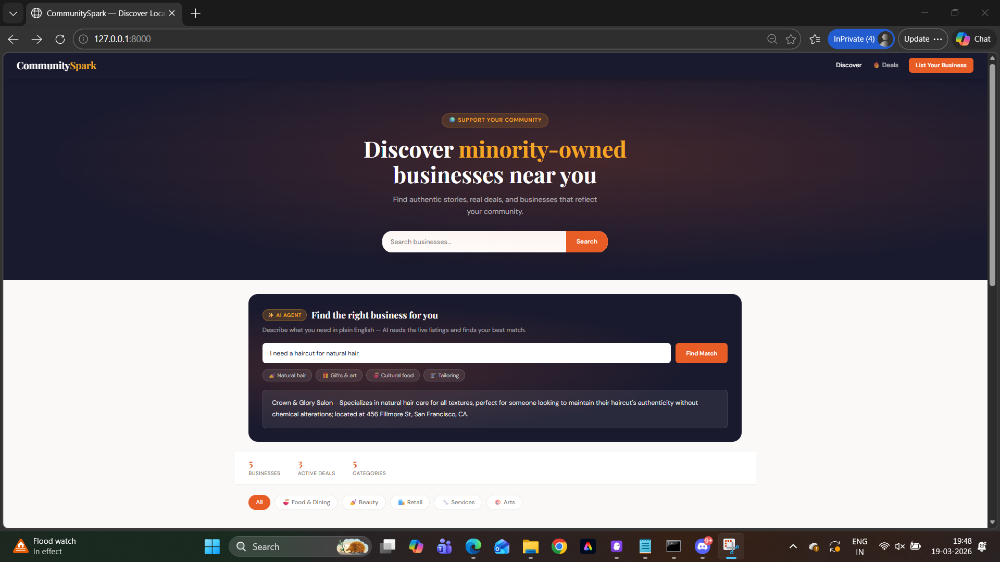
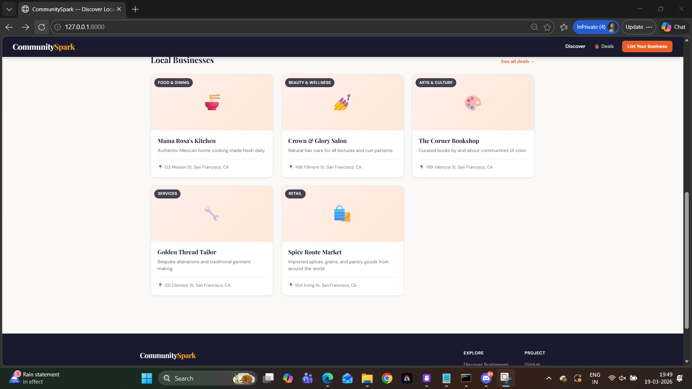
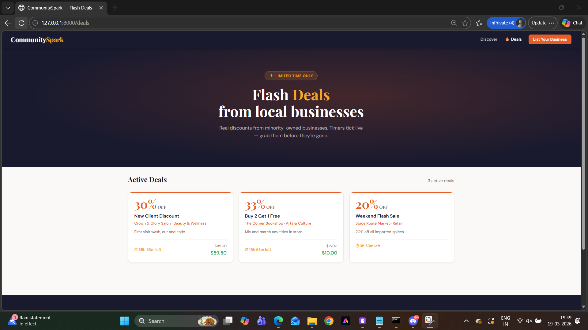
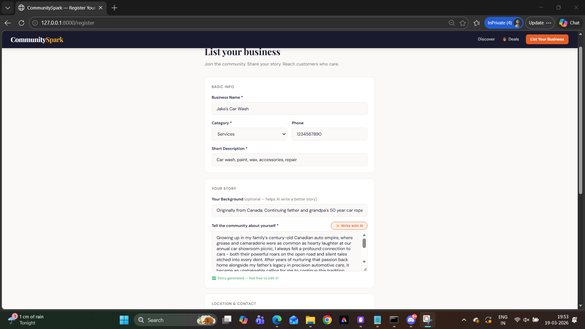
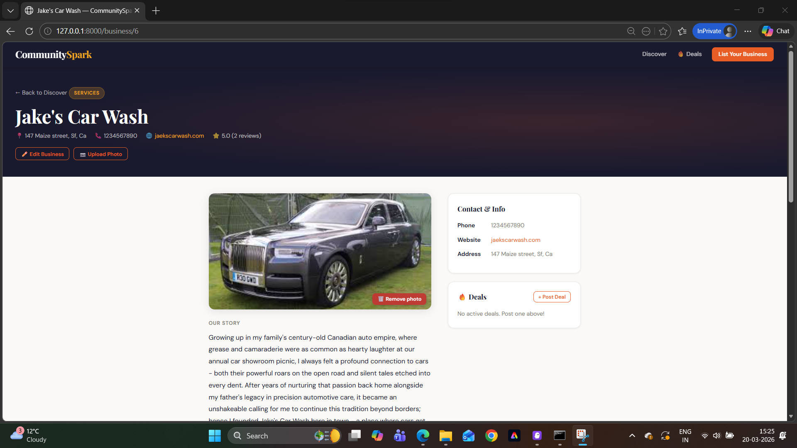

# CommunitySpark 🌍
### A discovery platform for minority-owned and community businesses

> "68% of minority-owned small businesses report that limited visibility and lack of digital presence are their biggest barriers to growth." — U.S. Senate Committee on Small Business & Entrepreneurship

---

## What Is This?

CommunitySpark is a zero-friction platform where minority-owned and community businesses can:
- **Register** in under 2 minutes with their authentic story and category
- **Post flash deals** that expire automatically with live countdown timers
- **Get discovered** by locals who want to support community businesses

Visitors can:
- **Browse and filter** businesses by category
- **Ask the AI matchmaker** in plain English — *"I need a haircut for natural hair"* — and get relevant recommendations instantly
- **Leave reviews** to help businesses build reputation

No Yelp algorithm. No paid visibility. No corporate bias. Just community.

---

## Quick Start (3 commands)

```bash
# 1. Create and activate virtual environment
python -m venv venv
source venv/bin/activate      # Mac/Linux
venv\Scripts\activate         # Windows

# 2. Install dependencies
pip install -r requirements.txt

# 3. Run
uvicorn main:app --reload
```

Open **http://localhost:8000** — 5 sample businesses, 4 deals, and 5 reviews load automatically on first run. No `.env` file needed. No external services.

### For AI features (optional but recommended)
```bash
# Install Ollama from https://ollama.com then:
ollama pull phi3
# Ollama runs automatically in the background after install
```

---

## Pages

| URL | Description |
|-----|-------------|
| `http://localhost:8000` | Home — browse businesses + AI matchmaker |
| `http://localhost:8000/deals` | Flash deals with live countdown timers |
| `http://localhost:8000/register` | Register a new business |
| `http://localhost:8000/business/1` | Example business profile |
| `http://localhost:8000/api/agents/status` | Check AI + Ollama status |
| `http://localhost:8000/docs` | Auto-generated API docs |

---

## Architecture

```
communityspark/
├── main.py                  # FastAPI app, route registration, lifespan
├── database.py              # SQLite init, schema, seed data
├── models.py                # Pydantic request/response models
├── mcp_server.py            # MCP server — AI agents as Kiro tools
├── routers/
│   ├── businesses.py        # Business CRUD + image upload/delete
│   ├── deals.py             # Flash deals + edit + time extension + expiry
│   ├── reviews.py           # Review submission and retrieval
│   └── agents.py            # AI story writer + matchmaker endpoints
├── templates/               # Jinja2 HTML pages
├── static/
│   ├── css/styles.css       # All CSS — no framework
│   └── uploads/             # Uploaded business photos (auto-created, not committed)
└── .kiro/
    ├── steering/project.md  # Project conventions for Kiro
    ├── specs/               # Feature specs (business reg, deals, AI agents)
    ├── hooks/               # Automation hooks (ruff, deal expiry check)
    └── mcp.json             # MCP server config
```

### How the AI matchmaker works

```
User: "I need a haircut for natural hair"
         ↓
Python keyword matching → identifies "Beauty & Wellness"
         ↓
Filters SQLite DB → only beauty businesses sent to AI
         ↓
Ollama (local LLM) → picks best match from filtered list
         ↓
"Crown & Glory Salon — specializes in natural hair care for all textures"
```

Key decision: **Python filters first, AI reasons second.** This prevents hallucination.

---

## How Kiro Was Used

| Feature | Usage |
|---------|-------|
| **AI Chat** | Debugging async SQLite handling, Jinja2 template issues, prompt iteration |
| **Steering** | Enforced no external APIs, async-first code, consistent response shapes |
| **Hooks** | `ruff-on-save.json` — auto-runs linting on every Python file save |
| **Specs** | Full specs for business registration, deals engine, AI agents |
| **MCP** | Both AI agents exposed as Kiro tools via `mcp_server.py` |

---

## Key Design Decisions

| Decision | Reason |
|----------|--------|
| SQLite over Supabase | Zero setup, single file, auto-created on first run |
| Ollama over OpenAI | No API key, no cost, fully local, works offline |
| Vanilla JS over React | No build step, fast load, works on older devices |
| FastAPI | Async-first, auto `/docs`, Pydantic validation |

---

## Environment Variables (all optional)

| Variable | Default | Description |
|----------|---------|-------------|
| `OLLAMA_URL` | `http://localhost:11434` | Ollama server URL |
| `OLLAMA_MODEL` | `llama3.2` | Model to use (auto-detected if not set) |

---

## What's Next

- [ ] Lightweight JWT auth for verified business owners
- [ ] Map view with Leaflet.js (no API key needed)
- [ ] Pagination for large listings
- [ ] Docker container for easy community self-hosting
- [ ] APScheduler to replace asyncio deal expiry

---

## Build Journey

See [BUILDING.md](BUILDING.md) for the full process — decisions made, what worked, what failed, and lessons learned.

---


---

## Project Overview

### The Problem
Minority-owned and community businesses are systematically invisible on mainstream platforms. Yelp and Google Maps bury small businesses without ad budgets. There is no dedicated space that centers their stories, amplifies their deals, and connects them with locals who genuinely want to support them.

### Target Users
- **Business owners** — independent, minority-owned, and community businesses who need visibility without complexity or cost
- **Community members** — locals who want to discover and support businesses that reflect their neighborhood
- **Community organisations** — groups that want to help member businesses get online quickly

### Solution Summary
A zero-friction web platform with three core loops:

1. **Discovery** — browse, filter, and AI-match businesses by category or natural language query
2. **Deals** — post and discover time-limited flash deals with live countdown timers
3. **Stories** — every business has a founder story; AI helps write it so the barrier to listing is as low as possible

### Key Features
- Business registration with AI-generated founder story (Ollama, local LLM)
- Category filter pills and keyword search
- Business profile pages with story, contact info, deals, and reviews
- Flash deals with live countdown timers, urgency banners, and auto-expiry
- Edit, extend, or delete deals after posting
- Photo upload per business (JPEG/PNG/WebP, max 5 MB)
- Edit and delete business listings
- AI matchmaker — natural language → relevant business recommendations
- MCP server exposing both AI agents as tools inside Kiro
- Auto-generated interactive API docs at `/docs`

---

## Full API Reference

All endpoints are prefixed with `/api`.

| Method | Endpoint | Description |
|--------|----------|-------------|
| `GET` | `/api/businesses` | List all businesses (supports `?category=` and `?search=`) |
| `POST` | `/api/businesses` | Register a new business |
| `GET` | `/api/businesses/{id}` | Get a business with its deals and reviews |
| `PUT` | `/api/businesses/{id}` | Edit business fields (partial update) |
| `DELETE` | `/api/businesses/{id}` | Delete a business and cascade deals and reviews |
| `POST` | `/api/businesses/{id}/image` | Upload a business photo (JPEG/PNG/WebP, max 5 MB) |
| `DELETE` | `/api/businesses/{id}/image` | Remove the business photo |
| `POST` | `/api/deals` | Post a flash deal |
| `GET` | `/api/deals` | List all active deals |
| `PUT` | `/api/deals/{id}` | Edit a deal (title, discount, time extension, urgency threshold) |
| `DELETE` | `/api/deals/{id}` | Expire or remove a deal |
| `POST` | `/api/reviews` | Submit a review |
| `GET` | `/api/agents/status` | Check Ollama status and installed models |
| `POST` | `/api/agents/generate-story` | AI: generate a founder story |
| `POST` | `/api/agents/match` | AI: find businesses matching a natural language request |

---

## Business Management

From any business profile page, owners can:

- Edit all fields (name, description, story, category, address, phone, website) via the ✏️ Edit button
- Upload a photo (JPEG, PNG, WebP — max 5 MB) stored in `static/uploads/`
- Remove the uploaded photo — cards fall back to a category emoji automatically
- Delete the business entirely — cascades to all associated deals and reviews

---

## Flash Deals

- Post a deal with title, discount %, original price, and expiry in hours
- Edit a deal after posting — title, description, discount, price, and time
- Extend or shorten remaining time using the `extend_hours` field (positive = extend, negative = shorten)
- Set an urgency threshold: when X hours remain, a sticky dismissible banner fires at the top of the page
- Delete a deal manually at any time

---

## Design Decisions — Security & Scalability

| Concern | Current approach | Production path |
|---------|-----------------|-----------------|
| **Auth** | No auth — anyone can post (acceptable for hackathon demo) | JWT tokens or session-based auth; owner claim verified on write operations |
| **Image storage** | Local `static/uploads/` with UUID filenames | Object storage (S3-compatible) behind a CDN for horizontal scaling |
| **Deal expiry** | `asyncio.sleep` background task — does not survive restarts | APScheduler or a cron job querying `expires_at < now()` |
| **Database** | SQLite single file — zero setup, no concurrency issues at low scale | PostgreSQL with connection pooling for multi-instance deployments |
| **Input validation** | Pydantic models on all POST/PUT routes; MIME type check on uploads | Rate limiting per IP; CSRF tokens on state-changing forms |
| **AI abuse** | No rate limiting on agent endpoints | Token bucket rate limiter per IP; prompt injection filtering |
| **Scalability** | Single-process uvicorn — fine for community-scale traffic | Gunicorn with multiple uvicorn workers; stateless app design allows horizontal scaling |

---

## Kiro Usage

| Feature | How it was used |
|---------|----------------|
| **AI Chat** | Debugging async SQLite connection handling; fixing Jinja2 template rendering; iterating on AI prompts (story writer went through 4 versions); resolving 405 errors caused by route ordering |
| **Steering** | `.kiro/steering/project.md` — enforced no external APIs, async-first code, consistent `{"data", "error"}` response shape, and route ordering rules across the entire build |
| **Hooks** | `ruff-on-save.json` — auto-runs `ruff check` and `ruff format --check` on every Python file save; `deal-expiry-check.json` — verifies background task is wired on every edit to `deals.py` |
| **Specs** | Three full specs written before coding: business registration, deals engine, AI agents — each with user stories, acceptance criteria, data models, and task checklists |
| **MCP** | `mcp_server.py` exposes both AI agents (`generate_business_story`, `find_matching_businesses`) as tools callable directly from inside Kiro — no browser needed |

---

## Learning Journey & Forward Thinking

### What I learned

**Steering files change everything.** Setting up `.kiro/steering/project.md` on day one meant every Kiro suggestion stayed within the project's constraints automatically. No re-explaining tech choices. No fighting the AI to not add React or call OpenAI.

**Specs before code is worth the friction.** Writing acceptance criteria upfront felt slow. It wasn't. Kiro used those specs to generate implementations that matched exactly what was needed first time.

**Python filters beat prompt engineering.** The AI matchmaker initially hallucinated connections between unrelated businesses — recommending a tailor for a haircut request. Every attempt to fix it in the prompt made it either too strict (always "no match") or too loose (tailor again). The real fix: filter by business category in Python before the AI sees anything. The AI cannot hallucinate a result it never receives.

**Local LLMs are production-viable for short-form tasks.** Ollama with llama3 produced consistently good founder stories after the prompt was tuned. No API key. No cost. Works offline.

**MCP is a genuine workflow improvement.** Wiring both AI agents into Kiro via `mcp_server.py` meant I could call live app functionality from inside the IDE. It felt like giving Kiro a real connection to the product it was helping build.

### Challenges

- Route ordering in FastAPI — sub-routes like `POST /{id}/image` must be registered before catch-all routes like `GET /{id}` or FastAPI returns 405. Kiro's steering file now documents this as a rule.
- Ollama cold start — the first AI request after a server start can take 10–30 seconds while the model loads into memory. A `/api/agents/status` endpoint was added so the UI can warn users.
- Streaming vs waiting — an early attempt at streaming Ollama responses added complexity without improving reliability. Simplified to standard request/response.

### Future plans

- Lightweight JWT auth so only verified owners can edit or delete their listings
- Map view with Leaflet.js — no API key required
- Pagination for business listings at scale
- Docker container for easy one-command community self-hosting
- APScheduler to replace `asyncio.sleep`-based deal expiry
- Moderation queue for new business registrations

---

## CI/CD

GitHub Actions runs on every push and pull request to `main`:

1. **Lint** — `ruff check .` and `ruff format --check .`
2. **Deploy** — runs after lint passes on pushes to `main`

See [`.github/workflows/ci.yml`](.github/workflows/ci.yml).

---

## Screenshots

Homepage — AI search and business listings:


Listings with categories and deals:


Deals page with countdown timers:


Business registration form:


Business profile with reviews:


---

## Sample Data

On first run the database seeds automatically with:
- 5 community businesses across Food, Beauty, Arts, Services, and Retail
- 4 active flash deals with expiry times
- 5 reviews across multiple businesses

The SQLite file (`communityspark.db`) is created automatically — no setup required.

---

## License

[MIT](LICENSE)

---

## Project Overview

### The Problem

Independent and minority-owned businesses are systematically invisible online. Platforms like Yelp prioritize businesses that pay for ads. Google Maps buries small operators under chain results. The result: a barbershop run by a family for 30 years gets zero foot traffic while a franchise across the street dominates search results.

**Target users:**
- **Business owners** — community businesses who need visibility without paying for it
- **Local residents** — people who actively want to support minority-owned businesses but don't know where to find them

### Solution Summary

CommunitySpark is a self-hosted, zero-dependency discovery platform. Any business can register in under 2 minutes. Any visitor can find them instantly — by browsing, filtering, searching, or asking the AI matchmaker in plain English.

### Key Features

| Feature | Description |
|---------|-------------|
| Business registry | Self-registration with story, category, address, photo, and contact info |
| Flash deals | Time-limited discounts with live countdown timers and auto-expiry |
| Reviews | Star ratings and comments to build community trust |
| AI Story Writer | Generates a warm first-person founder story from basic inputs |
| AI Matchmaker | Natural language search — "I need a haircut for natural hair" → Crown & Glory Salon |
| Business management | Edit, photo upload/removal, delete — all from the profile page |
| MCP server | Both AI agents exposed as tools inside Kiro |
| Auto-seeded data | 5 businesses, 4 deals, 5 reviews on first run — no manual setup |

---

## API Reference

All endpoints are prefixed with `/api`. Full interactive docs at `/docs` when the server is running.

| Method | Endpoint | Description |
|--------|----------|-------------|
| `GET` | `/api/businesses` | List all businesses (supports `?category=` and `?search=`) |
| `POST` | `/api/businesses` | Register a new business |
| `GET` | `/api/businesses/{id}` | Get a business with its deals and reviews |
| `PUT` | `/api/businesses/{id}` | Edit business fields (partial update) |
| `DELETE` | `/api/businesses/{id}` | Delete a business and all its deals and reviews |
| `POST` | `/api/businesses/{id}/image` | Upload a business photo (JPEG/PNG/WebP, max 5 MB) |
| `DELETE` | `/api/businesses/{id}/image` | Remove the business photo |
| `POST` | `/api/deals` | Post a flash deal |
| `GET` | `/api/deals` | List all active non-expired deals |
| `PUT` | `/api/deals/{id}` | Edit a deal (title, discount, time extension, urgency threshold) |
| `DELETE` | `/api/deals/{id}` | Expire/remove a deal |
| `POST` | `/api/reviews` | Submit a review |
| `GET` | `/api/agents/status` | Check Ollama status and installed models |
| `POST` | `/api/agents/generate-story` | AI: generate a founder story |
| `POST` | `/api/agents/match` | AI: find businesses matching a natural language request |

---

## Design Decisions, Trade-offs & Scalability

### Technology Choices

| Decision | Reason | Trade-off |
|----------|--------|-----------|
| **SQLite** over Supabase/Postgres | Zero setup, single file, auto-created on first run — anyone can run this | Doesn't scale horizontally; swap to Postgres for multi-server deployments |
| **Ollama** over OpenAI/Anthropic | No API key, no cost, fully local, works offline | Cold start delay of 10–30s on first request; mitigated by `/api/agents/status` |
| **Vanilla JS** over React/Vue | No build step, no node_modules, loads fast on older/low-end devices | Less component reuse; acceptable for a community tool with modest interactivity |
| **FastAPI** over Flask/Django | Async-first, auto `/docs`, Pydantic validation built in | Smaller ecosystem than Django; fine for this scope |
| **Python-first AI filtering** | Keyword map filters DB in Python before calling LLM — prevents hallucination | Requires maintaining the keyword map as categories grow |

### Security Considerations

- **No authentication** in this version — a deliberate hackathon trade-off for zero-friction onboarding. In production: JWT or session-based auth so only verified owners can edit/delete their listings.
- **File upload validation** — MIME type checked server-side; files over 5 MB rejected; UUID-based filenames prevent path traversal.
- **SQL injection** — all queries use parameterised statements via `aiosqlite`.
- **XSS** — all user content is HTML-escaped via `escHtml()` in JavaScript before rendering.
- **`static/uploads/`** and `communityspark.db` are excluded from git via `.gitignore`.

### Scalability Path

CommunitySpark is intentionally built for community self-hosting at small scale. For larger deployments:

1. Swap SQLite → PostgreSQL (one connection string change in `database.py`)
2. Replace `asyncio.sleep` deal expiry → APScheduler or a cron job
3. Add pagination to `/api/businesses` (currently returns all records)
4. Add a CDN or object storage (S3/R2) for uploaded photos
5. Package as a Docker container for one-command community self-hosting

---

## Kiro Usage

CommunitySpark was built entirely inside Kiro. Here's how each feature was used:

### Vibe Coding with AI Chat

Kiro's AI Chat was used throughout the build as a true pair programmer — not just for code generation but for debugging, architecture decisions, and iteration:

- Debugged async SQLite connection handling (connections not closing in `finally` blocks)
- Fixed a Jinja2 template rendering issue where `business_id` was passed as a string instead of int
- Iterated on the AI matchmaker prompt through 4 versions until it stopped hallucinating irrelevant businesses
- Discovered the FastAPI route ordering bug (`POST /{id}/image` must be registered before `GET /{id}`) via Kiro chat

### Spec-Driven Development

Features were specced in `.kiro/specs/` before any code was written. Each spec contains user stories, acceptance criteria, data models, API endpoints, and a task checklist. Kiro used these specs to generate implementations that matched requirements on the first attempt.

Specs written:
- `.kiro/specs/business-registration.md` — full CRUD, image upload, edit/delete
- `.kiro/specs/deals-engine.md` — deals, urgency banners, time extension, edit/delete
- `.kiro/specs/ai-agents.md` — story writer, matchmaker, MCP wiring, prompt iterations

### Steering Docs

`.kiro/steering/project.md` was set up on day one with `inclusion: always`. This meant Kiro knew the project's conventions — async-first, no external APIs, consistent response shapes, route ordering rules — without needing to re-explain them in every chat session.

Key steering rules that saved the most time:
- "Do NOT add external API dependencies" — prevented Kiro from suggesting Supabase or OpenAI
- "Route ordering rule: register sub-routes before catch-alls" — after discovering the 405 bug once, the rule was added to steering so it never happened again

### Agent Hooks

Two hooks in `.kiro/hooks/`:

- `ruff-on-save.json` — triggers `ruff check .` and `ruff format --check .` on every Python file save; Kiro reports issues inline
- `deal-expiry-check.json` — triggers a check that `BackgroundTasks` is correctly wired whenever `routers/deals.py` is edited

### MCP Integration

`mcp_server.py` exposes both AI agents as tools callable from inside Kiro:

```python
@mcp.tool()
def generate_business_story(business_name, category, ...) -> str

@mcp.tool()
def find_matching_businesses(user_request) -> str
```

This enabled a workflow where Kiro could query the live database and generate story drafts without leaving the IDE — genuinely useful for testing prompt quality during development.

---

## Learning Journey & Forward Thinking

### What Worked

- **Steering files on day one** — the single biggest productivity unlock. Setting up `.kiro/steering/project.md` before writing any code meant every Kiro suggestion stayed within the project's constraints automatically.
- **Spec before code** — writing specs felt slow at first. It wasn't. Kiro's implementations matched the specs closely enough that most routes needed zero revision.
- **Python-first AI filtering** — the matchmaker initially sent all businesses to the LLM and hallucinated connections (a tailor kept being recommended for haircuts). Moving category filtering into Python code before the LLM call solved it completely. Lesson: don't ask AI to do what deterministic code can do better.
- **Local LLMs for short-form creative writing** — Ollama's quality for the story writer was better than expected. The founder stories it generated were warm and personal, not generic.

### What Didn't Work

- **Streaming AI responses** — initially built with SSE streaming so text appeared word-by-word. The implementation was complex and fragile across different browsers. Switched to simple JSON responses. Simpler is better.
- **Ollama cold start** — first AI request after server start takes 10–30 seconds. Added `/api/agents/status` to let the UI surface this, but a proper pre-warm on startup would be better.
- **Inline styles in templates** — early HTML had a lot of inline styles for speed. They accumulated and made templates hard to read. Steering now enforces moving styles to `styles.css`.
- **`asyncio.sleep` for deal expiry** — works during a session but doesn't survive server restarts. A proper APScheduler or DB-polling cron would be more reliable.

### Challenges

- **Route ordering in FastAPI** — `POST /api/businesses/{id}/image` registered after `GET/PUT/DELETE /api/businesses/{id}` caused 405 errors. The fix was simple (register sub-routes first) but took time to diagnose. Now documented in steering so it never happens again.
- **LLM hallucination** — the matchmaker went through multiple prompt engineering iterations before the output was reliable. Final solution was architectural, not just prompt-based: filter in Python, reason in AI.

### Future Plans

- [ ] Lightweight JWT auth for verified business owners
- [ ] Map view with Leaflet.js (no API key needed)
- [ ] Pagination for large business listings
- [ ] APScheduler to replace `asyncio.sleep` deal expiry
- [ ] Docker container for one-command community self-hosting
- [ ] Admin moderation queue for new business registrations
- [ ] Business hours and availability display
- [ ] Email notifications when a deal is about to expire

---

## Screenshots

### Homepage — Business Discovery + AI Matchmaker


### Business Listings with Categories


### Flash Deals with Live Countdown Timers


### Register a Business with AI Story Writer


### Business Profile with Reviews


---

## CI/CD

GitHub Actions runs on every push and pull request to `main`:

1. **Lint** — `ruff check .` and `ruff format --check .`
2. **Deploy** — runs after lint passes on pushes to `main`

See [`.github/workflows/ci.yml`](.github/workflows/ci.yml).

---

## .kiro Directory

The `.kiro/` directory is included in this repository. It contains:

```
.kiro/
├── steering/
│   └── project.md          # Project-wide conventions loaded into every Kiro session
├── specs/
│   ├── business-registration.md
│   ├── deals-engine.md
│   └── ai-agents.md
├── hooks/
│   ├── ruff-on-save.json   # Auto-lint on Python file save
│   └── deal-expiry-check.json
└── mcp.json                # MCP server config for Kiro
```

## License

[MIT](LICENSE)
